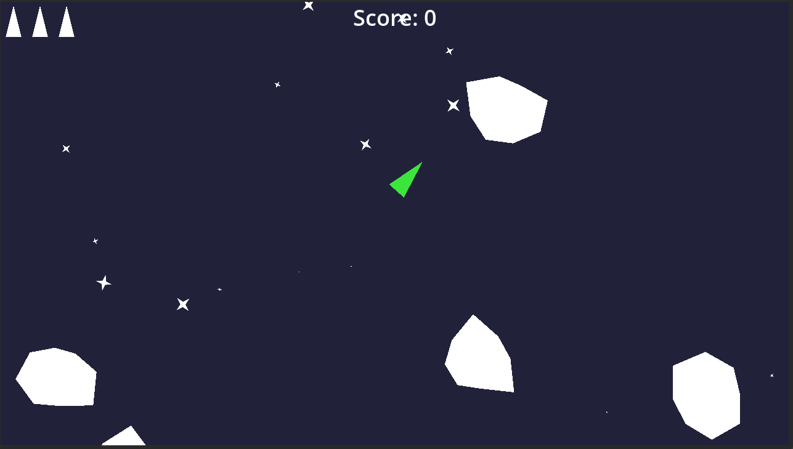

Godot Asteroids Clone

---

This is a clone of the classic Asteroids game made in the Godot game engine

It is my first project using Godot, done over 2 weeks with the aims of getting started with the engine and learning to use it for future projects

The features in this project helped me to learn many Godot features such as sound effects and music, particle effects, saved scores and settings, as well as more godot-specific things like the scene and node system and signals etc

Some small things like the turning speed or asteroid count limit may need to be tweaked, but overall I believe the gameplay features are all there and working, which was the main goal

All of the programming, music and artwork in this project was made by me

Sound Effects were generated with [jsfxr](https://sfxr.me)

Music was made using [Vital Synthesizer](https://vital.audio) in [Reaper DAW](https://www.reaper.fm)
